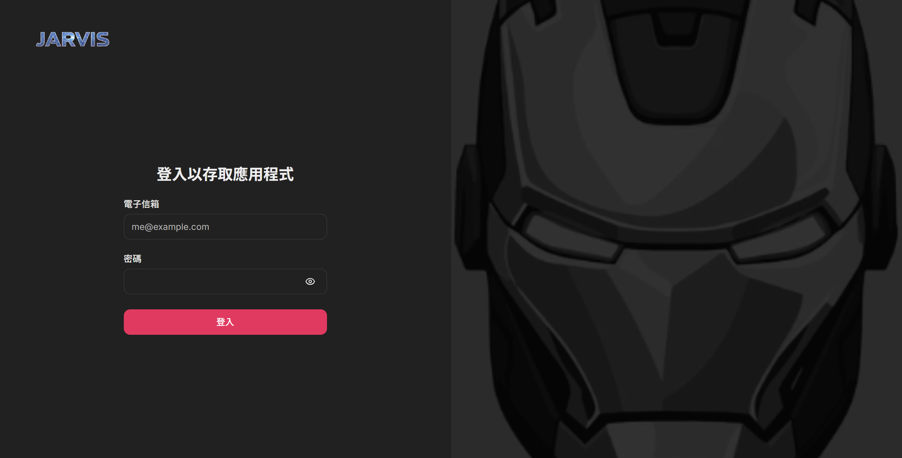
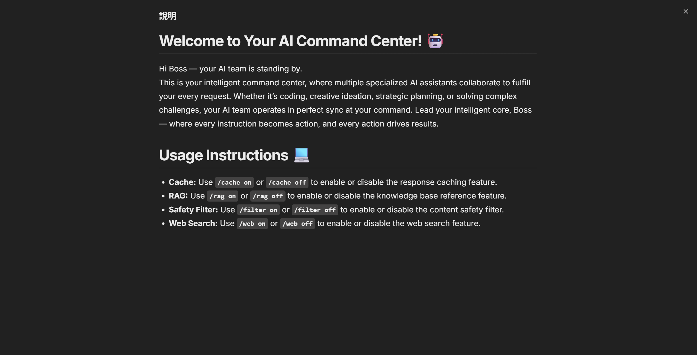
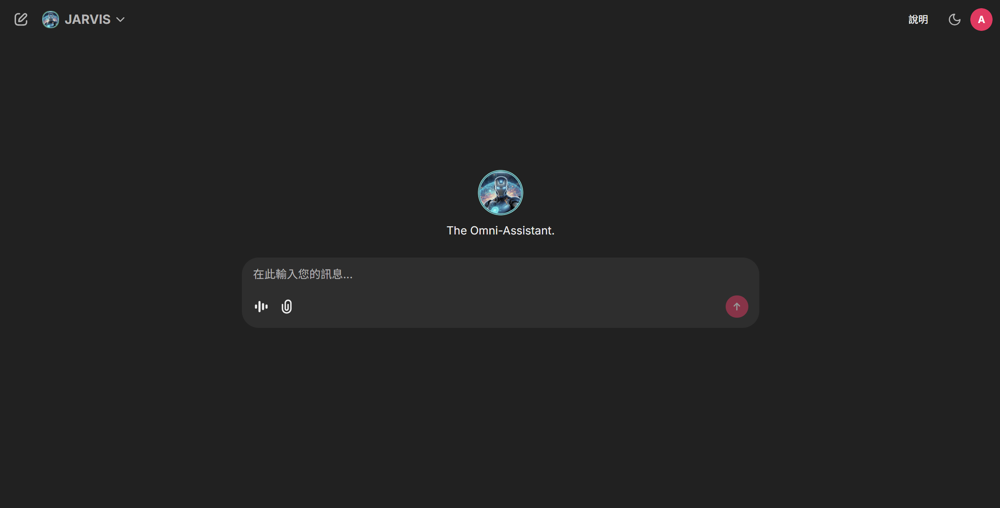
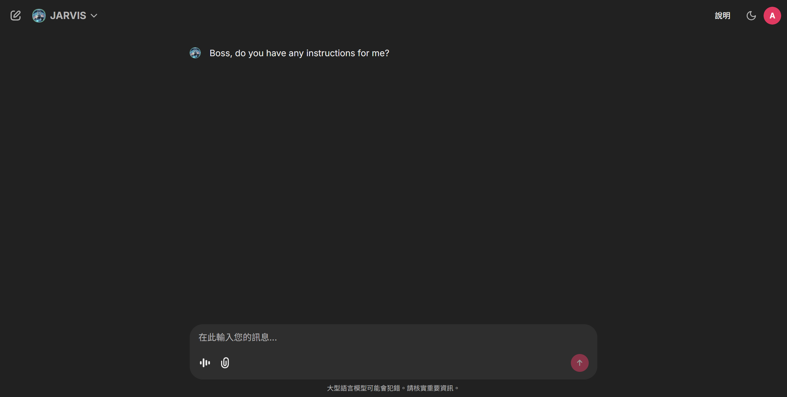

# JARVIS

## 🧠 Introduction
A high-performance AI Q&A platform powered by **LangChain**, featuring a complete **RAG pipeline**, **role-based model switching**, **voice interaction**, and **real-time web search**. Designed for accuracy, speed, and extensibility, the system combines local knowledge bases, user-uploaded documents, and web search to deliver context-rich answers.

## 🚀 Features
### 🔗 Backend & Frontend Architecture
- **Django Backend** providing secure and scalable API services.
- **Chainlit Frontend** offering an intuitive chat-based UI.
- Clean and stable communication between modules via well-defined APIs.

### 🌐 CORS & Security
- Fully configured **Cross-Origin Resource Sharing** for safe cross-domain communication.

### 🧩 LangChain Orchestration
- Unified management of retrieval and generation workflows.
- Fast construction of modular, intelligent QA pipelines.

### 📚 Full RAG Pipeline
- Automated document parsing, chunking, embedding, and vector storage.
- Vector database–powered semantic retrieval for high-precision knowledge access.

### 📁 User File Upload
- Supports user-uploaded documents.
- Automatically chunked, vectorized, and added to the retrieval system for personalized knowledge querying.

### 🎯 Knowledge-Enhanced Answers
Combines:
- Retrieved documents  
- User-provided files  
- Real-time search data  
Produces context-enriched prompts for accurate and reliable responses.

### 🔍 Optimized Chunking & Semantic Search
- Efficient text-splitting logic.
- High-relevance semantic search powered by embeddings.

### 🌐 Real-Time Web Search
- Integrated with **SerpAPI**.
- Retrieves titles, summaries, and links as structured search results.

### 🧠 Hybrid Answer Generation
- Merges local knowledge, uploaded files, and live web data.
- Generates comprehensive and trustworthy responses.

### 👤 Role-Based Model Switching
- Supports multiple specialized language models, providing more context-aware and precise answers.

### ⚡ Response Caching
- Built-in caching for significantly faster responses to repeated queries.

### 🛡 Content Filtering
- Ensures all generated replies remain safe and compliant.

### 🎙 Voice Input Support
- Supports audio-based queries for natural human–AI interaction.

## 🖥 Interface Overview
Screenshots of the platform showcasing login, documentation, dashboard, and chat interface.

### 🔑 Login Screen
The login interface where users securely enter credentials to access the platform.

### 📝 Info Page
Documentation and guidance page providing instructions and usage tips for users.

### 🎛 Main Panel
The main dashboard showing key controls, model selection, and user options.

### 💬 Chat Interface
A comprehensive chat interface allowing users to enter text, record voice messages, upload files, select AI models, and initiate new conversations.

## 📚 Reference
- Llama-3.2-3B-Instruct: [Hugging Face](https://huggingface.co/meta-llama/Llama-3.2-3B-Instruct)
- whisper-small: [Hugging Face](https://huggingface.co/openai/whisper-small)
  
